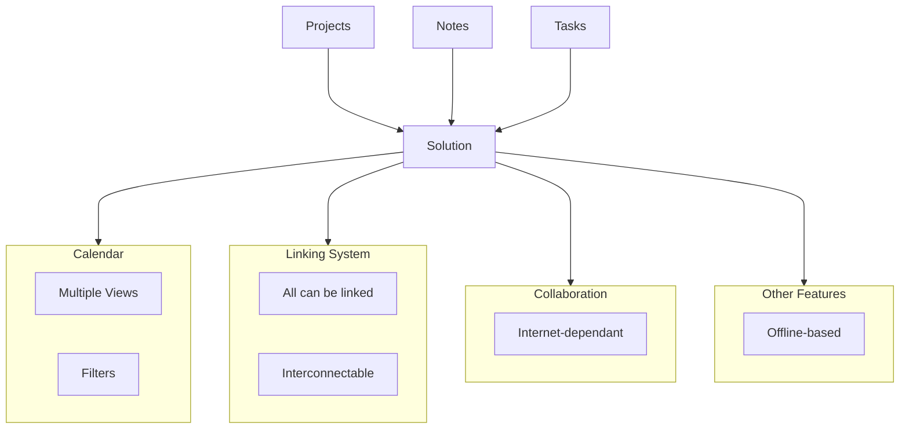

As an individual contributor who works within a team in many different structures (SCRUM, KANBAN, SCRUMBAN, waterfall, adhoc...) and organises himself with many different tools (get things done, calendars, reminders...); I really miss a tool that really connects my thoughts and my projects/tasks properly with my tech stack.

 I will confess that I have a physical notebook for this project, but I really **love** having a digital environment with an offline experience that it is enhanced when it's synced up with the Internet. I do not want to carry a notebook for each project and look/sync with my agenda to understand what I need to do or at least be aware of it.

Techniques like Zettelkasten, second brain and many others are a bit too complex to set up across different digital data systems (iOS/Android, Google/Exchange/iCloud...), and most important of it: is resource expensive in terms of time and money.

